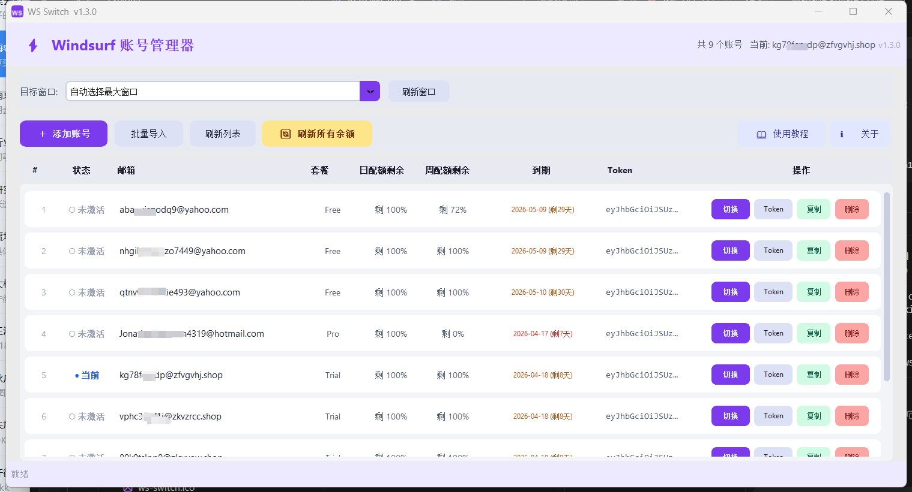

# ⚡ WS Switch

[](https://github.com/aixiaoxin123/ws-switch/releases/latest)
[](https://github.com/aixiaoxin123/ws-switch/releases/latest)
[](#)

> Windsurf 多账号快速切换工具 — 无需浏览器，一键切换账号并自动重启 Windsurf

---

## 📥 下载

**[➡ 点击前往最新版本下载页](https://github.com/aixiaoxin123/ws-switch/releases/latest)**

下载 `ws-switch.exe`，双击运行，无需安装任何依赖。

**网盘备用下载：**  
链接: https://pan.baidu.com/s/11Y0u5LJEVg8QB7WdFoawcQ?pwd=aixi 提取码: `aixi`

---

## 💬 QQ 交流群

扫码加入 QQ 群，或直接搜索群号：**913520711**（非商业，仅学习交流）


> 也可添加作者微信：`aixiaoxin123123`，备注「ws-switch」拉你进群。

---

## 一、软件简介

WS Switch 是一款专为 Windsurf 用户设计的**多账号快速切换工具**。

**主要功能：**
- 管理多个 Windsurf 账号（添加 / 删除 / 批量导入）
- 一键切换账号，自动重启 Windsurf
- 实时获取账号的 Firebase Token
- 查看各账号的套餐、日配额、周配额余额

**系统要求：** Windows 10 / 11，已安装 Windsurf

---

## 二、软件安装

### 方式一：直接运行 exe（推荐）

1. 前往 [Releases 页面](https://github.com/aixiaoxin123/ws-switch/releases/latest) 下载 `ws-switch.exe`
2. 双击运行，无需安装任何依赖

### 方式二：安装包安装（待更新）

> ⚠️ 此功能暂未实现，后续版本将提供安装包，敬请期待。

---

## 三、主界面介绍



```
┌─────────────────────────────────────────────────────┐
│  ⚡ Windsurf 账号管理器           共 N 个账号        │  ← 顶部标题栏
├─────────────────────────────────────────────────────┤
│  目标窗口: [自动选择最大窗口 ▼]  [刷新窗口]         │  ← 窗口选择栏
├─────────────────────────────────────────────────────┤
│  [＋ 添加账号] [批量导入] [刷新列表] [🔄 刷新余额]  │  ← 工具栏
├──────┬──────┬──────────┬──────┬──────┬──────────────┤
│  #   │ 状态 │   邮箱   │ 套餐 │日配额│  操作按钮    │  ← 列表表头
├──────┼──────┼──────────┼──────┼──────┼──────────────┤
│  1   │●当前 │ a@xx.com │ Pro  │  80% │[切换][Token] │  ← 账号行
│  2   │○未激活│b@xx.com │  —   │  —   │[切换][Token] │
└─────────────────────────────────────────────────────┘
│  状态栏：就绪                                        │
└─────────────────────────────────────────────────────┘
```

| 区域 | 功能 |
|------|------|
| **顶部标题栏** | 显示软件名称和账号总数、当前使用账号 |
| **窗口选择栏** | 选择要切换的 Windsurf 目标窗口（多窗口时使用） |
| **工具栏** | 添加账号、批量导入、刷新列表、刷新余额 |
| **账号列表** | 展示所有账号状态，支持切换/获取Token/删除 |
| **状态栏** | 实时显示操作进度和结果 |

---

## 四、添加账号

### 4.1 手动添加单个账号

1. 点击工具栏中的「**＋ 添加账号**」按钮
2. 在弹出的对话框中填写：
   - **邮箱**：Windsurf 登录邮箱（如 `user@example.com`）
   - **密码**：对应的登录密码
3. 点击「**确定**」保存
4. 账号将出现在列表中，状态显示为「○ 未激活」

### 4.2 批量导入账号

1. 点击「**批量导入**」按钮
2. 在文本框中按以下格式，每行输入一个账号：
   ```
   邮箱;密码
   ```
   例如：
   ```
   user1@example.com;password123
   user2@example.com;mypassword
   user3@gmail.com;abc456
   ```
3. 也可以点击「**从文件选择**」，直接加载本地 `.txt` 文件
4. 点击「**确定**」，软件会自动去重并导入
   - 导入完成后弹出汇总：`成功 N 个  重复 N 个  失败 N 个`

---

## 五、切换账号

> ⚠️ **切换前请确认 Windsurf 已打开**，软件会自动关闭并重启 Windsurf。  
> ⚠️ **多窗口注意**：切换时**所有 Windsurf 窗口都会被关闭**，重启后只会打开一个窗口。

1. 在账号列表中找到目标账号
2. 点击该行右侧的「**切换**」按钮（紫色）
3. 状态栏显示切换进度：`正在切换到 user@example.com...`
4. 软件依次执行：Firebase 登录验证 → 获取 API Key → 关闭 Windsurf → 写入 session → 重启 Windsurf
5. 切换完成后，对应账号状态变为「● 当前」

### 多窗口切换

1. 点击窗口选择栏中的下拉菜单
2. 选择要操作的目标窗口标题
3. 再进行切换操作

---

## 六、获取 Token / 查看余额

### 6.1 获取单个账号 Token

1. 在账号行点击「**Token**」按钮（蓝灰色）
2. 软件自动登录并获取 Firebase ID Token
3. 弹出 Token 展示对话框，点击「**复制并关闭**」即可复制

### 6.2 批量刷新所有账号余额

1. 点击工具栏中的「**🔄 刷新所有余额**」（黄色按钮）
2. 状态栏实时显示进度：`正在获取 Token (3/10)...`
3. 完成后列表自动更新，显示套餐、日配额、周配额

---

## 七、删除账号

1. 在账号行点击「**删除**」按钮（红色）
2. 弹出确认提示，点击「**是**」确认删除

> ⚠️ 删除操作不可撤销，请谨慎操作。

---

## 八、账号状态说明

| 状态标识 | 颜色 | 含义 |
|---------|------|------|
| `● 当前` | 蓝色 | 当前 Windsurf 正在使用的账号 |
| `● 活跃` | 绿色 | 已激活但非当前使用的账号 |
| `○ 未激活` | 灰色 | 尚未切换使用过的账号 |

---

## 九、常见问题

**Q1：切换账号失败，提示「Firebase 登录失败」**  
原因：邮箱或密码错误，或账号已被封禁。检查账号密码是否正确，尝试在 Windsurf 官网重新登录验证。

**Q2：切换后 Windsurf 没有重新打开**  
原因：Windsurf 安装路径不在默认位置（`%LOCALAPPDATA%\Programs\Windsurf\Windsurf.exe`）。手动打开 Windsurf 即可，账号数据已成功写入。

**Q3：余额显示「—」**  
原因：该账号尚未获取过 Token。点击「🔄 刷新所有余额」更新数据。

**Q4：软件提示「找不到 Windsurf 窗口」**  
原因：Windsurf 未启动或窗口已最小化到托盘。确保 Windsurf 已打开并在任务栏可见，点击「刷新窗口」重新检测。

**Q5：账号数据存储在哪里？**  
账号数据保存在本地文件 `C:\Users\<用户名>\.windsurf-accounts.json`，可手动备份。

---

## 十、注意事项

1. **请勿在切换过程中操作 Windsurf**，等待状态栏显示成功后再使用。
2. 账号密码以明文存储在本地 JSON 文件中，请确保设备安全。
3. 本工具仅在 **Windows** 系统上可用。
4. 切换账号会短暂中断 Windsurf 服务（约 5-10 秒）。

---

## 详细使用教程

👉 [查看完整使用教程](docs/使用教程.md)

---

*WS Switch v1.2.0 | 仅供个人学习使用*
